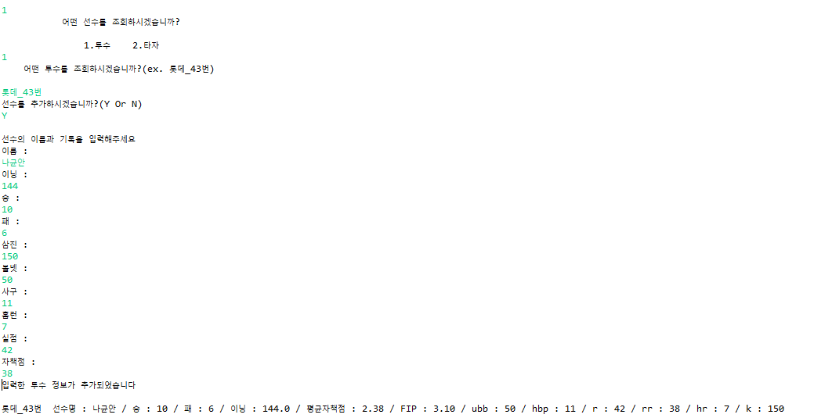
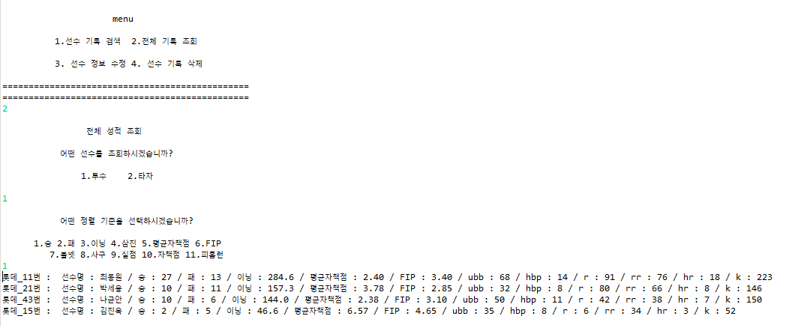

<h1 align="center">KBO Player Record Searching Program</h1>
 
 

  

<h3 align="center">KBO Player Record Searching Program은 야구 선수들의 기록 관리를 위한</h3> 

<h3 align="center">Java Project 입니다.</h3>
 
 
 
 

<h1 align="center">KBO Player Record Searching Program 사용 예시</h1>
 
 

<h3 align="center">기록 검색</h3>

<h5 align="center">KBO Player Record Searching Program은 선수들의 기록 검색을 제공합니다.</h5>

----

 
 

<h3 align="center">기록 추가</h3>

<h5 align="center">KBO Player Record Searching Program은 선수 기록이 없을 시,</h5>
<h5 align="center">선수 기록 추가 기능을 제공합니다.</h5>

----

 
 

<h3 align="center">전체 기록 조회</h3>

<h5 align="center">KBO Player Record Searching Program에 등록된 전체 선수의</h5>
<h5 align="center">기록을 조회할 수 있습니다.</h5>

----

 
 
<h3 align="center">이외에도 선수기록 수정이나 삭제 등의 기능을 제공합니다.</h3>
 
 
